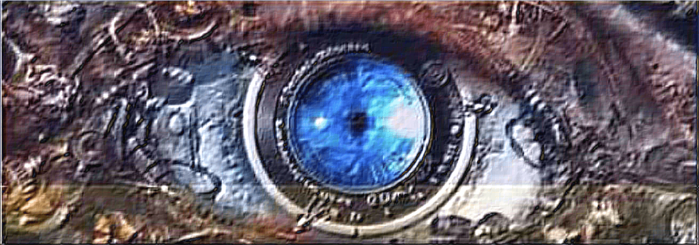
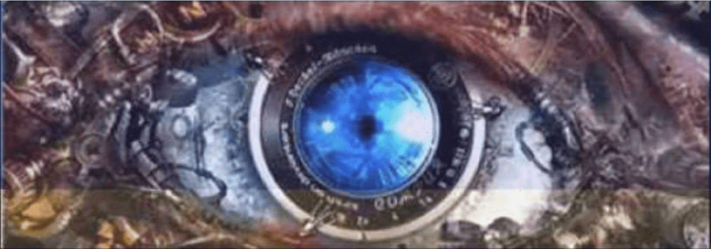
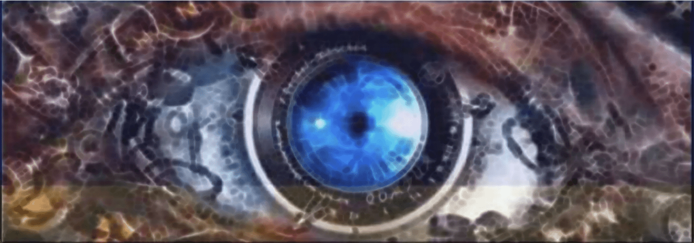
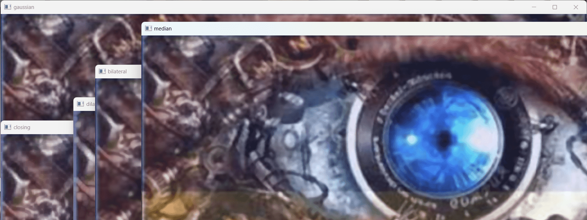
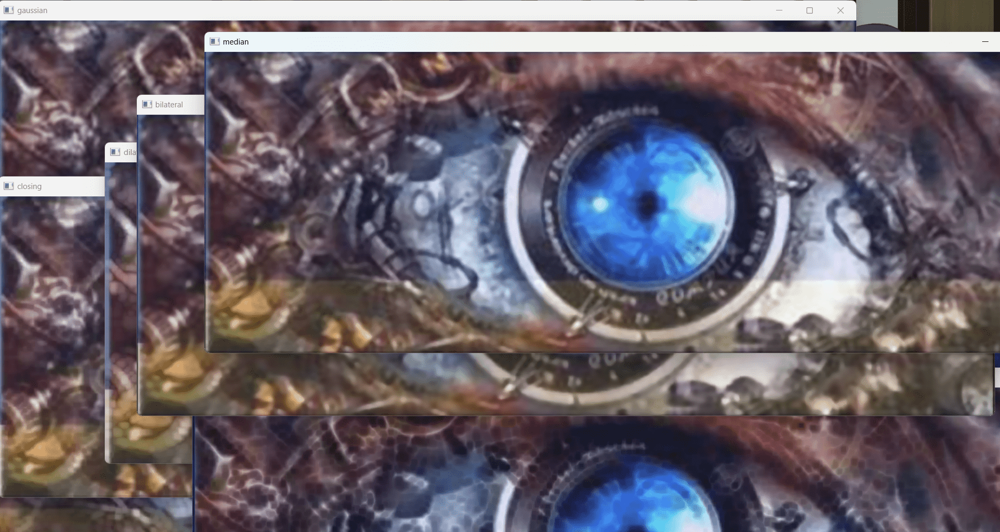

```python
# 滤波：模板不含负数
import cv2 as cv
import numpy as np

kernel = np.array([[3, 2, 3], [2, 1, 2], [3, 2, 3]]) / 21.0  # 定义滤波核

im = cv.imread("eye.jpg")  # 读取图像
out = cv.filter2D(im, -1, kernel)  # 滤波
# cv.imshow("origin", im)  # 显示原图像
cv.imshow("out", out)  # 显示滤波结果
cv.waitKey(0)  # 等待按键
cv.destroyAllWindows()  # 关闭窗口

# ---------------------
# 滤波：模板含负数
import cv2 as cv
import numpy as np

kernel = np.array([[-2, -1, 0], [-1, 1, 1], [0, 1, 2]])  # 定义滤波核

im = cv.imread("eye.jpg")  # 读取图像
out = cv.filter2D(im, cv.CV_32F, kernel)  # 滤波
out = cv.convertScaleAbs(out)  # 转换为uint8类型(0~255)
# cv.imshow("origin", im)  # 显示原图像
cv.imshow("out", out)  # 显示滤波结果
cv.waitKey(0)  # 等待按键
cv.destroyAllWindows()  # 关闭窗口

# ---------------------
# 滤波：分通道再合成
import cv2 as cv
import numpy as np

kernel = np.array([[5, 2, 5], [2, 0, 2], [5, 2, 5]]) / 28.0  # 定义滤波核

im = cv.imread("eye.jpg")  # 读取图像
b, g, r = cv.split(im)  # 通道分离
b = cv.filter2D(b, -1, kernel)  # 滤波
g = cv.filter2D(g, -1, kernel)  # 滤波
r = cv.filter2D(r, -1, kernel)  # 滤波
out = cv.merge([b, g, r])  # 通道合并
# cv.imshow("origin", im)  # 显示原图像
cv.imshow("out", out)  # 显示滤波结果
cv.waitKey(0)  # 等待按键
cv.destroyAllWindows()  # 关闭窗口

# ---------------------
# 滤波：频域滤波
import cv2 as cv
import numpy as np


def cutBy_fft(im, k=0.5):
    fft2 = np.fft.fft2(im)  # 傅里叶变换
    fft2 = np.fft.fftshift(fft2)  # 中心化
    n, m = fft2.shape
    zeros = np.zeros((n, m), dtype=complex)
    zeros[
        int((n - k * n) / 2) : int((n + k * n) / 2),
        int((m - k * m) / 2) : int((m + k * m) / 2),
    ] = fft2[
        int((n - k * n) / 2) : int((n + k * n) / 2),
        int((m - k * m) / 2) : int((m + k * m) / 2),
    ]
    fft2 = np.fft.ifftshift(zeros)  # 中心化
    fft2 = np.fft.ifft2(fft2)  # 傅里叶反变换
    return cv.convertScaleAbs(np.uint8(np.abs(fft2)))


im = cv.imread("eye.jpg")  # 读取图像
b, g, r = cv.split(im)  # 通道分离
b = cutBy_fft(b, 0.5)  # 滤波
g = cutBy_fft(g, 0.5)  # 滤波
r = cutBy_fft(r, 0.5)  # 滤波
out = cv.merge([b, g, r])  # 通道合并
# cv.imshow("origin", im)  # 显示原图像
cv.imshow("out", out)  # 显示滤波结果
cv.waitKey(0)  # 等待按键
cv.destroyAllWindows()  # 关闭窗口


# ---------------------
# 常用形态学处理算法
import cv2

cv2.MORPH_ERODE  # 腐蚀
cv2.MORPH_DILATE  # 膨胀
cv2.MORPH_OPEN  # 开运算
cv2.MORPH_CLOSE  # 闭运算
cv2.MORPH_GRADIENT  # 形态学梯度
cv2.MORPH_TOPHAT  # 顶帽
cv2.MORPH_BLACKHAT  # 黑帽
cv2.MORPH_HITMISS  # 击中击不中

# 常用形态学结构元素
cv2.MORPH_RECT  # 矩形
cv2.MORPH_CROSS  # 十字形
cv2.MORPH_ELLIPSE  # 椭圆形


# ---------------------
# 形态学处理
import cv2
import numpy as np

kernel = cv2.getStructuringElement(cv2.MORPH_ELLIPSE, (5, 5))  # 定义结构元素
im = cv2.imread("eye.jpg")  # 读取图像
b, g, r = cv2.split(im)  # 通道分离
b = cv2.morphologyEx(b, cv2.MORPH_HITMISS, kernel)
g = cv2.morphologyEx(g, cv2.MORPH_HITMISS, kernel)
r = cv2.morphologyEx(r, cv2.MORPH_HITMISS, kernel)
out = cv2.merge([b, g, r])  # 通道合并
# cv2.imshow("origin", im)  # 显示原图像
cv2.imshow("out", out)  # 显示滤波结果
cv2.waitKey(0)  # 等待按键
cv2.destroyAllWindows()  # 关闭窗口
```








```python
import cv2 as cv
import numpy as np
import cv2.ximgproc

# 读取图像
im = cv.imread("eye.jpg")

# 高斯滤波
gaussian = cv.GaussianBlur(im, (5, 5), 0)

# 中值滤波
median = cv.medianBlur(im, 5)

# 双边滤波
bilateral = cv.bilateralFilter(im, 9, 75, 75)

# 形态学操作
kernel = np.ones((5, 5), np.uint8)
erosion = cv.erode(im, kernel, iterations=1)
dilation = cv.dilate(im, kernel, iterations=1)
opening = cv.morphologyEx(im, cv.MORPH_OPEN, kernel)
closing = cv.morphologyEx(im, cv.MORPH_CLOSE, kernel)


# 雾去除
def dehaze(image, w=0.95, t0=0.55, Amax=220):
    gray = cv.cvtColor(image, cv.COLOR_BGR2GRAY)
    gray = cv.medianBlur(gray, 5)
    dc = cv.ximgproc.createFastGlobalSmootherFilter(gray, 15, 200, 200)
    t = dc.filter(gray, gray)
    t = cv.max(t, t0 * 255)
    t = cv.min(t, 255)
    t = t.astype(np.uint8)
    A = dc.filter(image, t)
    A = cv.medianBlur(A, 5)
    A = cv.cvtColor(A, cv.COLOR_BGR2GRAY)  # Convert to single-channel image
    A = np.minimum(A, Amax)
    J = np.zeros_like(image)
    for i in range(3):
        J[:, :, i] = (image[:, :, i] - A) / cv.max(w, t / 255.0) + A
    J = cv.max(J, 0)
    J = cv.min(J, 255)
    J = J.astype(np.uint8)
    return J


dehazed = dehaze(im)

# 显示结果
cv.imshow("origin", im)
cv.imshow("gaussian", gaussian)
cv.imshow("median", median)
cv.imshow("bilateral", bilateral)
cv.imshow("erosion", erosion)
cv.imshow("dilation", dilation)
cv.imshow("opening", opening)
cv.imshow("closing", closing)
cv.imshow("dehazed", dehazed)
cv.waitKey(0)
cv.destroyAllWindows()
```




