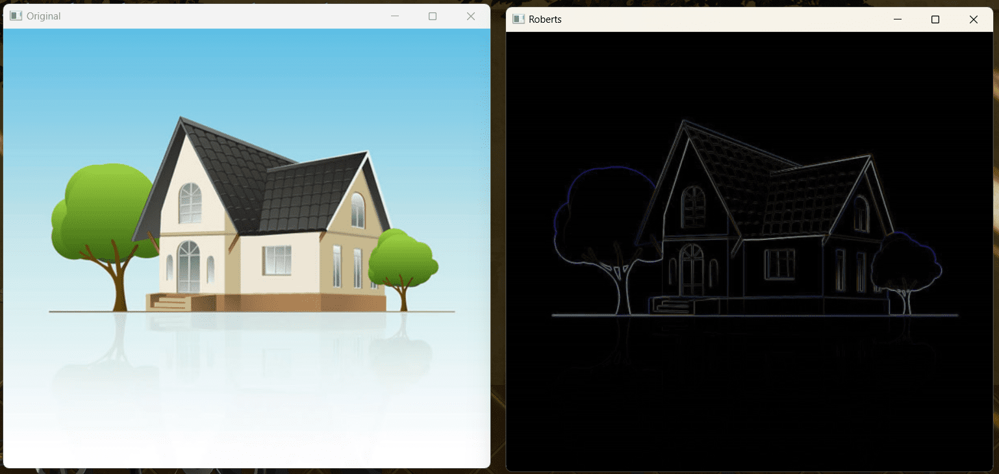
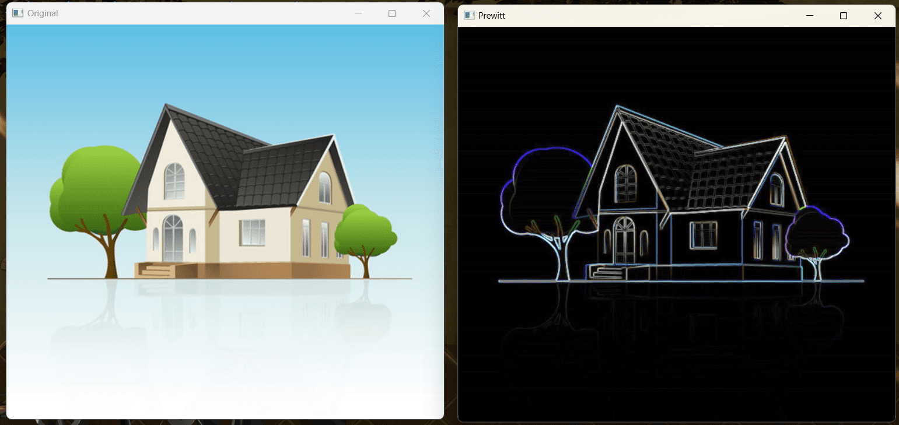
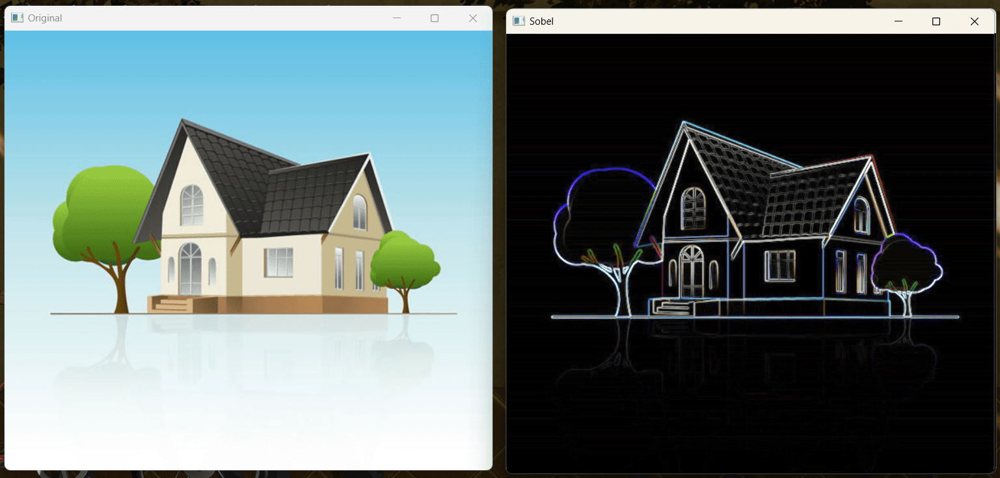
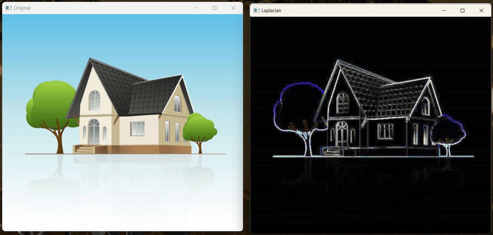
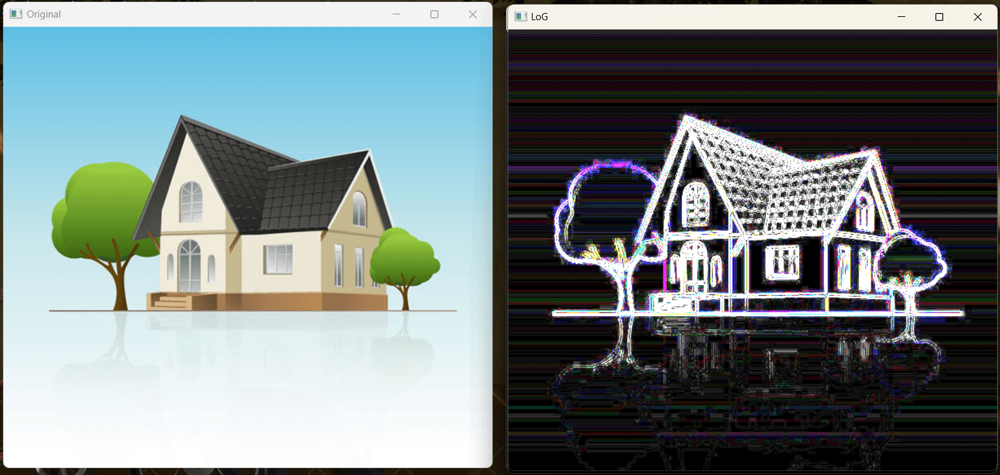
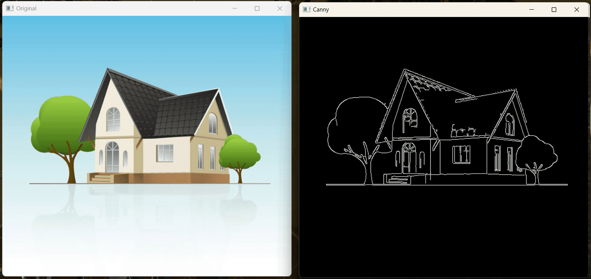
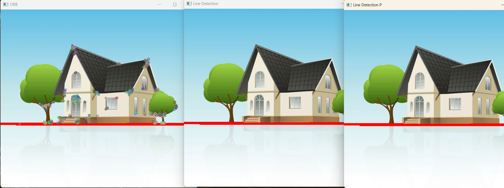
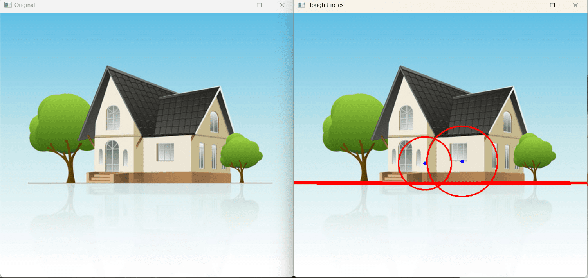

相关代码
```python
import cv2
import numpy as np


# ---------------------边缘检测---------------------
# 罗伯茨(Roberts)算子
def getRoberts(img):
    # Roberts算子
    kernelx = np.array([[-1, 0], [0, 1]], dtype=int)
    kernely = np.array([[0, -1], [1, 0]], dtype=int)
    x = cv2.filter2D(img, cv2.CV_16S, kernelx)
    y = cv2.filter2D(img, cv2.CV_16S, kernely)
    absX = cv2.convertScaleAbs(x)
    absY = cv2.convertScaleAbs(y)
    Roberts = cv2.addWeighted(absX, 0.5, absY, 0.5, 0)
    return Roberts


# 普雷维特(Prewitt)算子
def getPrewitt(img):
    # Prewitt算子
    kernelx = np.array([[1, 1, 1], [0, 0, 0], [-1, -1, -1]], dtype=int)
    kernely = np.array([[-1, 0, 1], [-1, 0, 1], [-1, 0, 1]], dtype=int)
    x = cv2.filter2D(img, cv2.CV_16S, kernelx)
    y = cv2.filter2D(img, cv2.CV_16S, kernely)
    # 转uint8
    absX = cv2.convertScaleAbs(x)
    absY = cv2.convertScaleAbs(y)
    # Prewitt = cv2.addWeighted(absX, 0.5, absY, 0.5, 0)
    Prewitt = (0.5 * absX**2.0 + 0.5 * absY**2.0) ** 0.5
    return cv2.convertScaleAbs(np.uint8(Prewitt))


# 索贝尔(Sobel)算子
def getSobel(img):
    # Sobel算子
    kernelx = np.array([[1, 2, 1], [0, 0, 0], [-1, -2, -1]], dtype=int)
    kernely = np.array([[-1, 0, 1], [-2, 0, 2], [-1, 0, 1]], dtype=int)
    x = cv2.filter2D(img, cv2.CV_16S, kernelx)
    y = cv2.filter2D(img, cv2.CV_16S, kernely)
    # 转uint8
    absX = cv2.convertScaleAbs(x)
    absY = cv2.convertScaleAbs(y)
    Prewitt = (0.5 * absX**2.0 + 0.5 * absY**2.0) ** 0.5
    return cv2.convertScaleAbs(np.uint8(Prewitt))


# 拉普拉斯(Laplacian)算子
def getLaplacian(img):
    # Laplacian算子
    # kernel = np.array([[0, 1, 0], [1, -4, 1], [0, 1, 0]], dtype=int)
    kernel = np.array([[1, 1, 1], [1, -8, 1], [1, 1, 1]], dtype=int)
    # kernel = np.array([[-1, 2, -1], [2, -4, 2], [-1, 2, -1]], dtype=int)
    laplacian = cv2.filter2D(img, cv2.CV_16S, kernel)
    return cv2.convertScaleAbs(laplacian)


# 拉普拉斯-高斯(LoG)算子
def getLoG(img):
    # LoG算子
    kernel = -np.array(
        [
            [-2, -4, -4, -4, -2],
            [-4, 0, 8, 0, -4],
            [-4, 8, 24, 8, -4],
            [-4, 0, 8, 0, -4],
            [-2, -4, -4, -4, -2],
        ],
        dtype=int,
    )
    laplacian = cv2.filter2D(img, cv2.CV_16S, kernel)
    return cv2.convertScaleAbs(laplacian)


# 坎尼(Canny)算子
# img = cv2.imread("catdogN.jpg")
# out = cv2.Canny(img, 100, 200)
# cv2.imshow("img", img)
# cv2.imshow("out", out)
# cv2.waitKey(0)
def getCanny(img):
    # Canny算子
    return cv2.Canny(img, 100, 200)


# ---------------------角点检测---------------------
# ORB角点检测
# img = cv2.imread("catdog.jpg")
# out = np.copy(img)
# gray = cv2.cvtColor(img, cv2.COLOR_BGR2GRAY)
# # SIFT对象创建
# orb = cv2.ORB_create()
# # 进行检测，其中第二个参数为None，表示对整张图进行检测
# kp = orb.detect(gray, None)
# # 进行特征匹配
# # kp, des = orb.compute(gray, kp)
# kp, des = orb.detectAndCompute(gray, None)
# print(des)
# # 绘制角点
# cv2.drawKeypoints(image=out, keypoints=kp, outImage=out, color=(0, 255, 0))
# cv2.imshow("img", img)
# cv2.imshow("dst", out)
# cv2.waitKey(0)
def getORB(img):
    # ORB角点检测
    orb = cv2.ORB_create()
    return orb.detectAndCompute(img, None)


# ---------------------霍夫检测---------------------
# 标准霍夫变换
def line_detection(image):
    # 变换为灰度图
    gray = cv2.cvtColor(image, cv2.COLOR_BGR2GRAY)
    # 进行Canny边缘检测
    edges = cv2.Canny(gray, 50, 150, apertureSize=3)
    # cv2.imshow("edges", edges)
    # 标准霍夫变换
    lines = cv2.HoughLines(edges, 1, np.pi / 180, 200)
    for line in lines:  # 对检测到的每一条线段
        # 霍夫变换返回的是 r 和 theta 值
        rho, theta = line[0]
        a = np.cos(theta)
        b = np.sin(theta)
        # 确定x0和y0
        x0 = a * rho
        y0 = b * rho
        # 构建 (x1,y1) (x2,y2)
        x1 = int(x0 + 1000 * (-b))
        y1 = int(y0 + 1000 * (a))
        x2 = int(x0 - 1000 * (-b))
        y2 = int(y0 - 1000 * (a))
        # 用cv2.line函数在image上绘制直线
        cv2.line(image, (x1, y1), (x2, y2), (0, 0, 255), 2)
    # cv2.imshow("line_detection", image)
    # cv2.waitKey(0)
    return image


# 渐进概率式霍夫变换
def line_detectionP(image):
    # 变换为灰度图
    gray = cv2.cvtColor(image, cv2.COLOR_BGR2GRAY)
    # 进行Canny边缘检测
    edges = cv2.Canny(gray, 50, 150, apertureSize=3)
    # cv2.imshow("edges", edges)
    # 进行霍夫直线运算
    lines = cv2.HoughLinesP(
        edges, 1, np.pi / 180, 200, minLineLength=150, maxLineGap=20
    )
    if lines is not None:
        for line in lines:  # 对检测到的每一条线段
            for x1, y1, x2, y2 in line:
                # 用cv2.line函数在image上绘制直线
                cv2.line(image, (x1, y1), (x2, y2), (0, 0, 255), 2)
    # cv2.imshow("line_detection", image)
    # cv2.waitKey(0)
    return image


# 霍夫圆检测
def HoughCircles(src):
    image = np.array(src)
    cimage = cv2.cvtColor(image, cv2.COLOR_BGR2GRAY)  # 转化成灰度图像
    circles = cv2.HoughCircles(
        cimage,
        cv2.HOUGH_GRADIENT,
        1,
        40,
        param1=260,
        param2=50,
        minRadius=10,
    )
    # cv2.imshow("in", cimage)
    circles = np.uint16(np.around(circles))  # 取整
    for i in circles[0, :]:
        cv2.circle(image, (i[0], i[1]), i[2], (0, 0, 255), 2)  # 在原图上画圆，圆心、半径、颜色、线宽
        cv2.circle(image, (i[0], i[1]), 2, (255, 0, 0), 2)
    # cv2.putText(image, "param1:260,param2:50", (20, 20), cv2.FONT_HERSHEY_SIMPLEX, 0.75, (0, 0, 255), 2)
    # cv2.imshow("row_circles", image)
    return image
```

测试代码
```python
import cv2
import pptcode

# 加载测试图片
# img = cv2.imread("test.png")
img = cv2.imread("2.jpg")
cv2.imshow("Original", img)

# 测试边缘检测函数
roberts = pptcode.getRoberts(img)  # Roberts算子
prewitt = pptcode.getPrewitt(img)  # Prewitt算子
sobel = pptcode.getSobel(img)  # Sobel算子
laplacian = pptcode.getLaplacian(img)  # Laplacian算子
log = pptcode.getLoG(img)  # LoG算子
canny = cv2.Canny(img, 100, 200)  # Canny边缘检测

# 测试角点检测函数
orb = cv2.ORB_create()
kp, des = orb.detectAndCompute(img, None)

# 测试Hough变换函数
line_detection = pptcode.line_detection(img)  # 标准Hough变换
line_detectionP = pptcode.line_detectionP(img)  # 累计概率Hough变换
HoughCircles = pptcode.HoughCircles(img)  # Hough圆变换

# # 显示结果
# cv2.imshow("Roberts", roberts)
# cv2.imshow("Prewitt", prewitt)
# cv2.imshow("Sobel", sobel)
# cv2.imshow("Laplacian", laplacian)
# cv2.imshow("LoG", log)
# cv2.imshow("Canny", canny)
# cv2.imshow("ORB", cv2.drawKeypoints(img, kp, None))
# cv2.imshow("Line Detection", line_detection)
# cv2.imshow("Line Detection P", line_detectionP)
# cv2.imshow("Hough Circles", HoughCircles)
# cv2.waitKey(0)
# cv2.destroyAllWindows()
# 显示结果
cv2.imshow("Roberts", roberts)
cv2.waitKey(0)
cv2.imshow("Prewitt", prewitt)
cv2.waitKey(0)
cv2.imshow("Sobel", sobel)
cv2.waitKey(0)
cv2.imshow("Laplacian", laplacian)
cv2.waitKey(0)
cv2.imshow("LoG", log)
cv2.waitKey(0)
cv2.imshow("Canny", canny)
cv2.waitKey(0)
cv2.imshow("ORB", cv2.drawKeypoints(img, kp, None))
cv2.waitKey(0)
cv2.imshow("Line Detection", line_detection)
cv2.waitKey(0)
cv2.imshow("Line Detection P", line_detectionP)
cv2.waitKey(0)
cv2.imshow("Hough Circles", HoughCircles)
cv2.waitKey(0)
cv2.destroyAllWindows()
```

测试结果










总结？
在Python中，可以使用OpenCV库中的findContours函数来检测图像的轮廓、ORB算法来检测图像的角点、HoughLines和HoughCircles函数来检测图像中的直线和圆。
为了使轮廓获得很好的效果，可以尝试使用不同的阈值方法、调整阈值参数、进行图像预处理等方法。为了提高角点检测的准确率，可以尝试调整ORB算法中nfeatures、nlevels、scaleFactor等参数。以及进行图像预处理等方法。
综上，我掌握了如何使用OpenCV库中的findContours函数来检测图像的轮廓、ORB算法来检测图像的角点、HoughLines和HoughCircles函数来检测图像中的直线和圆。以及如何调整不同的参数以优化算法的性能，并进行图像预处理以提高算法的准确性。
