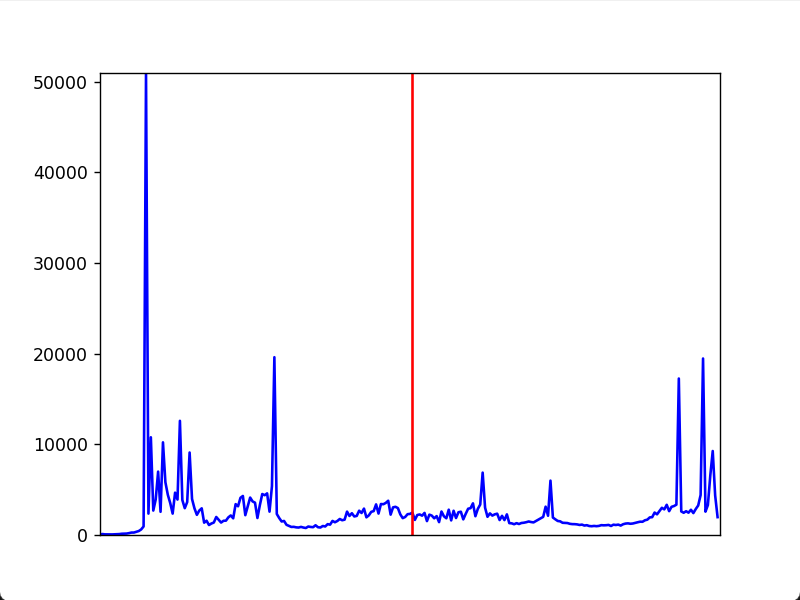
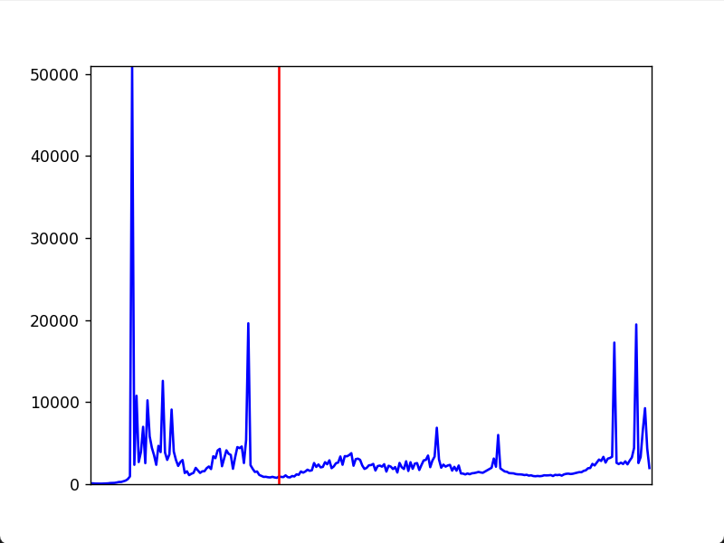

测试选用图片


<!--  -->

本次测试使用到的库为
```python
import cv2
import matplotlib.pyplot as plt
import numpy as np
from scipy import ndimage as ndi
from skimage import filters, morphology
```

定义两个函数用于获取直方图和显示结果
```python
def GrayHist(img):
    grayHist = np.zeros(256, dtype=np.uint64)
    for v in range(256):
        grayHist[v] = np.sum(img == v)
    return grayHist


def showResult(hist, thresh, threshImage_out):
    plt.plot(hist, color="b")
    plt.plot([thresh, thresh], [0, np.amax(hist)], color="r")
    plt.xlim(0, 256)
    plt.ylim(0, np.amax(hist))
    plt.xticks([])
    plt.show()
    cv2.imshow("out", threshImage_out)
```

一个示例
```python
# 按边缘分割举例
# 前处理：形态学+滤波
# 边缘检测：边缘检测
# 后处理：二值化+填充+形态学
def getSobel(img):
    # Sobel算子
    # kernelx = np.array([[1, 2, 1], [0, 0, 0], [-1, -2, -1]], dtype=np.int)
    kernelx = np.array([[1, 2, 1], [0, 0, 0], [-1, -2, -1]], dtype=int)
    # kernely = np.array([[-1, 0, 1], [-2, 0, 2], [-1, 0, 1]], dtype=np.int)
    kernely = np.array([[-1, 0, 1], [-2, 0, 2], [-1, 0, 1]], dtype=int)
    x = cv2.filter2D(img, cv2.CV_16S, kernelx)
    y = cv2.filter2D(img, cv2.CV_16S, kernely)
    # 转uint8
    absX = cv2.convertScaleAbs(x)
    absY = cv2.convertScaleAbs(y)
    Prewitt = (0.5 * absX**2.0 + 0.5 * absY**2.0) ** 0.5
    return cv2.convertScaleAbs(np.uint8(Prewitt))


def FillHole(mask):
    contours, hierarchy = cv2.findContours(mask, cv2.RETR_TREE, cv2.CHAIN_APPROX_SIMPLE)
    len_contour = len(contours)
    contour_list = []
    for i in range(len_contour):
        drawing = np.zeros_like(mask, np.uint8)
        img_contour = cv2.drawContours(drawing, contours, i, (255, 255, 255), -1)
        contour_list.append(img_contour)
    out = sum(contour_list)
    return out


# 示例
def example(img):
    # img = cv2.imread("img/1.jpg")
    image = cv2.cvtColor(img, cv2.COLOR_BGR2GRAY)
    out = getSobel(image)
    cv2.imshow("out", out)
    # 高斯滤波
    out = cv2.GaussianBlur(out, (5, 5), 0)
    out = cv2.GaussianBlur(out, (5, 5), 0)
    # OpenCV定义的结构元素
    kernel = cv2.getStructuringElement(cv2.MORPH_RECT, (5, 5))

    # 膨胀图像
    out = cv2.dilate(out, kernel)
    # 腐蚀图像
    out = cv2.erode(out, kernel)
    # 膨胀图像
    out = cv2.dilate(out, kernel)
    # 腐蚀图像
    out = cv2.erode(out, kernel)

    etVal, out = cv2.threshold(out, 80, 255, cv2.THRESH_BINARY)
    Filled = FillHole(out)
    # 腐蚀图像
    Filled = cv2.erode(Filled, kernel)
    # 膨胀图像
    Filled = cv2.dilate(Filled, kernel)
    cv2.imshow("in", img)
    cv2.imshow("Filled", Filled)
    # cv2.waitKey(0)
```

效果如下：


```python
# 最大类间差法（大津算法OTSU）
def OTSU(img):
    image = cv2.cvtColor(img, cv2.COLOR_BGR2GRAY)
    # 计算灰度直方图
    hist = GrayHist(image)
    # 高斯滤波后再采用OTSU阈值
    blur = cv2.GaussianBlur(image, (5, 5), 0)
    thresh, threshImage_out = cv2.threshold(
        blur, 0, 255, cv2.THRESH_BINARY | cv2.THRESH_OTSU
    )
    print("OTSU阈值：%s" % thresh)
    showResult(hist, thresh, threshImage_out)
    # 通过分割图割出实体
    out = img.copy()
    out[threshImage_out == 255] = 255
    cv2.imshow("out1", out)
```



```python
# 最小误差算法（双峰法）
def threshTwoPeaks(img):
    image = cv2.cvtColor(img, cv2.COLOR_BGR2GRAY)
    # 计算灰度直方图
    hist = GrayHist(image)
    # 寻找灰度直方图的最大峰值对应的灰度值
    maxLoc = np.where(hist == np.max(hist))  # maxLoc中存放的位置
    firstPeak = maxLoc[0][0]
    # 寻找灰度直方图的第二个峰值对应的灰度值
    elementList = np.arange(256, dtype=np.uint64)
    measureDists = np.power(elementList - firstPeak, 2) * hist
    maxLoc2 = np.where(measureDists == np.max(measureDists))
    secondPeak = maxLoc2[0][0]
    # 找到两个峰值之前的最小值对应的灰度值，作为阈值
    thresh = 0
    if secondPeak > firstPeak:
        firstPeak, secondPeak = secondPeak, firstPeak
    temp = hist[secondPeak:firstPeak]
    minLoc = np.where(temp == np.min(temp))
    thresh = secondPeak + minLoc[0][0] + 1
    # 找到阈值之后进行阈值处理，得到二值图
    threshImage_out = image.copy()
    # 大于阈值的都设置为255
    threshImage_out[threshImage_out > thresh] = 255
    # 小于等于阈值的都设置为0
    threshImage_out[threshImage_out <= thresh] = 0
    print("双峰法阈值：%s" % thresh)
    showResult(hist, thresh, threshImage_out)
    # 通过分割图割出实体
    # out = img.copy()
    # out[threshImage_out == 255] = 255
    # cv2.imshow("out2", out)
```



```python
# 迭代法
def threshIterative(img):
    img = cv2.cvtColor(img, cv2.COLOR_BGR2GRAY)
    # 计算灰度直方图
    hist = GrayHist(img)
    # 计算灰度直方图
    T = img.mean()
    while True:
        t0 = img[img < T].mean()
        t1 = img[img >= T].mean()
        t = (t0 + t1) / 2
        if abs(T - t) < 1:
            break
        T = t
    thresh = int(T)
    th, threshImage_out = cv2.threshold(img, thresh, 255, 0)
    print("迭代法阈值：%s" % thresh)
    showResult(hist, thresh, threshImage_out)
    # 通过分割图割出实体
    # out = img.copy()
    # out[threshImage_out == 255] = 255
    # cv2.imshow("out3", out)
```


```python
# 最大熵算法
def threshEntroy(img):
    image = cv2.cvtColor(img, cv2.COLOR_BGR2GRAY)
    rows, cols = image.shape
    # 获取直方图
    grayHist = GrayHist(image)
    # 得到概率直方图
    normgrayHist = grayHist / float(rows * cols)
    zeroCumuMoment = np.zeros([256], dtype=np.float32)
    for k in range(256):
        if k == 0:
            zeroCumuMoment[k] = normgrayHist[k]
        else:
            zeroCumuMoment[k] = zeroCumuMoment[k - 1] + normgrayHist[k]
    entropy = np.zeros([256], dtype=np.float32)
    # 计算每个灰度级的熵
    for k in range(256):
        if k == 0:
            if normgrayHist[k] == 0:
                entropy[k] = 0
            else:
                entropy[k] = -normgrayHist[k] * np.log10(normgrayHist[k])
        else:
            if normgrayHist[k] == 0:
                entropy[k] = entropy[k - 1]
            else:
                entropy[k] = entropy[k - 1] - normgrayHist[k] * np.log10(
                    normgrayHist[k]
                )
    ft = np.zeros([256], dtype=np.float32)
    ft1, ft2 = 0.0, 0.0
    totalEntropy = entropy[255]
    for k in range(255):
        # 找最大值
        maxFront = np.max(normgrayHist[: k + 1])
        maxBack = np.max(normgrayHist[k + 1 : 256])
        if (
            maxFront == 0
            or zeroCumuMoment[k] == 0
            or maxFront == 1
            or zeroCumuMoment[k] == 1
            or totalEntropy == 0
        ):
            ft1 = 0
        else:
            ft1 = (
                entropy[k]
                / totalEntropy
                * (np.log10(zeroCumuMoment[k]) / np.log10(maxFront))
            )
        if (
            maxBack == 0
            or 1 - zeroCumuMoment[k] == 0
            or maxBack == 1
            or 1 - zeroCumuMoment[k] == 1
            or totalEntropy == 0
        ):
            ft2 = 0
        else:
            if totalEntropy == 0:
                ft2 = np.log10(1 - zeroCumuMoment[k]) / np.log10(maxBack)
            else:
                ft2 = (
                    (1 - entropy[k])
                    / totalEntropy
                    * (np.log10(1 - zeroCumuMoment[k]) / np.log10(maxBack))
                )
        ft[k] = ft1 + ft2
    # 找出最大值的索引，作为得到的阈值
    thresLoc = np.where(ft == np.max(ft))
    thresh = thresLoc[0][0]

    # 阈值处理
    threshold = np.copy(image)
    threshold[threshold > thresh] = 255
    threshold[threshold <= thresh] = 0
    print("最大熵阈值：%s" % thresh)
    showResult(grayHist, thresh, threshold)
    # 返回分割图像，最大阈值，最大熵和熵
    # return threshold, thresh, np.max(ft), entropy
```


```python
# 自适应动态阈值分割
def adaptiveThresh(I, winSize=(25, 25), ratio=0.15):
    I = cv2.cvtColor(I, cv2.COLOR_BGR2GRAY)
    # 第一步：对图像矩阵进行均值平滑
    # I = cv2.GaussianBlur(I, winSize, 0)
    # I_mean = cv2.boxFilter(I, cv2.CV_32FC1, winSize)
    # I = cv2.boxFilter(I, cv2.CV_32FC1, (5,5))
    I = cv2.GaussianBlur(I, (5, 5), 5)
    I_mean = cv2.GaussianBlur(I, winSize, 5)
    # 第二步：原图像矩阵与平滑结果做差
    out = I - (1.0 - ratio) * I_mean
    # 第三步：当差值大于或等于0时，输出值为255，否则为0
    out[out >= 0] = 255
    out[out < 0] = 0
    out = out.astype(np.uint8)
    cv2.imshow("out", out)
    # return out
```


```python
# 基于距离变换的分水岭算法
def watershed(img):
    gray = cv2.cvtColor(img, cv2.COLOR_BGR2GRAY)
    # 阈值分割，将图像分为黑白两部分，阈值0,255，第四个参数THRESH_OSTU，它对一副双峰图像自动根据其直方图计算出合适的阈值
    ret, thresh = cv2.threshold(
        gray, 0, 255, cv2.THRESH_BINARY_INV + cv2.THRESH_OTSU
    )  # thresh返回图片，ret返回True或False，代表是否成功
    # cv2.imshow("thresh", thresh)
    # 去除噪声，对图像进行形态学的开运算（先进行腐蚀再进行膨胀的过程），使用闭运算可以去除对象中的空洞。
    kernel = np.ones((3, 3), np.uint8)  # 返回一个3*3的矩阵，矩阵中的元素全为1
    opening = cv2.morphologyEx(
        thresh, cv2.MORPH_OPEN, kernel, iterations=2
    )  # 2 顺序为腐蚀-腐蚀-膨胀-膨胀
    # cv2.imshow("opening", opening)
    # 背景的区域
    sure_bg = cv2.dilate(opening, kernel, iterations=3)  # 3
    # cv2.imshow("sure_bg", sure_bg)
    # 距离变换，前景的区域
    dist_transform = cv2.distanceTransform(opening, cv2.DIST_L2, 5)  # DIST_L2 可以为3或5
    ret, sure_fg = cv2.threshold(
        dist_transform, 0.1 * dist_transform.max(), 255, 0
    )  # 0.1时的效果好于其他
    # cv2.imshow("sure_fg", sure_fg)
    # sure_bg与sure_fg相减，得到既有前景又有背景的重合区域
    sure_fg = np.uint8(sure_fg)
    unknown = cv2.subtract(sure_bg, sure_fg)
    # 连通域处理
    ret, markers = cv2.connectedComponents(
        sure_fg, connectivity=8
    )  # 对连通区域进行标号，序号为 0 - N-1
    markers = markers + 1  # OpenCV分水岭算法对物体做的标注必须都大于1，背景为0，因此对所有的markers加1
    # 去掉属于背景区域的部分（即让其变为0，成为背景）
    markers[unknown == 255] = 0
    # 分水岭算法
    markers = cv2.watershed(img, markers)  # 分水岭算法后，所有轮廓的像素点被标记为-1
    # print(markers)
    img[markers == -1] = [0, 0, 255]  # 将所有轮廓的像素点标记为红色
    cv2.imshow("out", img)
```


```python
# 基于梯度的分水岭算法
def watershedG(img):
    image = cv2.cvtColor(img, cv2.COLOR_BGR2GRAY)
    denoised = filters.rank.median(image, morphology.disk(2))  # 中值滤波
    # 将梯度值低于10的作为开始标记点
    markers = filters.rank.gradient(denoised, morphology.disk(5)) < 10
    markers = ndi.label(markers)[0]
    gradient = filters.rank.gradient(denoised, morphology.disk(2))  # 梯度
    # 基于梯度的分水岭算法
    # labels = morphology.watershed(gradient, markers, mask=image)
    labels = ndi.watershed_ift(gradient, markers)
    cv2.imshow("out", cv2.convertScaleAbs(labels))
```


在本次实验中，我通过Python编程实现了对图片的阈值分割和分水岭算法。首先，选取了一幅图片，并对其进行了阈值分割处理。通过对图像进行灰度化、设置阈值以及二值化操作，成功地将图像分割成了前景和背景两部分。接着，使用分水岭算法对图像进行处理。分水岭算法是一种基于拓扑结构的图像分割方法，它能够根据图像的灰度差异来识别出不同的区域。之后通过边缘检测分割出了检测到的实体，灵活运用了滤波和形态学操作等综合手段。对图像进行了滤波操作，以去除噪声和平滑边缘。使用形态学操作如开运算和闭运算来填充边缘上的空洞或连接断开的边缘。最后，通过填充的图片从原图分割出实体。利用区域生长和区域分裂合并的方法分割出检测到的实体。区域生长是一种基于像素相似性的图像分割方法，它通过不断扩展和合并相似的区域来实现分割。首先定义了一个种子点，并将其周围的像素标记为目标区域。然后，将相邻的区域与种子点进行比较，如果相似度高则将其合并。重复这个过程直到无法再合并为止。
通过这次实验，对图像处理中的阈值分割、分水岭算法、边缘检测、形态学操作以及区域生长和区域分裂合并等方法有了更深入的了解和应用。这些方法在实际应用中可以用于图像分割、目标检测、图像重建等领域，具有广泛的应用前景。
